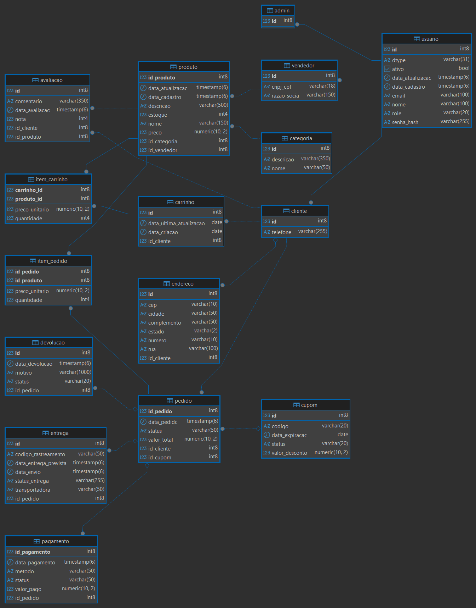

# 🚀 Desenvolvimento e Aplicação Web II - Projeto JPA

Este repositório contém o projeto prático da disciplina de Desenvolvimento de Aplicações Web II do curso de Análise e Desenvolvimento de Sistemas (ADS). O foco inicial é o domínio da **Java Persistence API (JPA)** e do padrão **DAO (Data Access Object)**.

---

## 📖 Sobre o Projeto
O objetivo desta etapa é realizar o Mapeamento Objeto-Relacional (ORM) de um modelo de dados, transformando classes Java em entidades persistentes sem a utilização de relacionamentos complexos (1:1, 1:N, N:N) neste primeiro momento.

## 🛠️ Tecnologias Utilizadas
* **Linguagem:** Java 17+
* **Framework:** Hibernate (Implementação JPA)
* **Arquitetura:** DAO (Data Access Object)
* **Build Tool:** Maven

---

## 🏗️ Estrutura e Padrões Implementados

### 1. Camada de Modelo (Entities)
Todas as entidades foram mapeadas utilizando as anotações padrão do JPA.
* Implementação obrigatória de `equals()`, `hashCode()` e `toString()`.
* Uso de estratégias de geração de ID e mapeamento de colunas.

### 2. Camada de Persistência (DAO)
Seguindo as orientações da disciplina, a estrutura de acesso a dados utiliza:
* **Interface Base:** `br.edu.ifpb.es.daw.dao.DAO`
* **Implementação Abstrata:** `br.edu.ifpb.es.daw.dao.impl.AbstractDAOImpl`

### 3. Principais Anotações JPA Aplicadas
| Anotação | Função |
| :--- | :--- |
| `@Entity` | Marca a classe como uma entidade gerenciada pelo JPA. |
| `@Table` | Define o nome da tabela no banco de dados. |
| `@Id` | Define a chave primária da entidade. |
| `@GeneratedValue` | Especifica a estratégia de geração do valor do ID. |
| `@Column` | Define propriedades específicas da coluna (ex: `unique`, `nullable`). |

---

## 🗺️ Modelo de Dados
Abaixo, a representação visual do modelo conceitual do projeto, que foi desenvolvido na disciplina de Banco de Dados I :

[🔗 Visualizar diagrama original no editor](https://app.brmodeloweb.com/#!/publicview/69a720f96431b763534360b3)

---
**Desenvolvido por: Lucas Barbosa; Paulo Moura e ValdênioPantaleão**
Estudantes de ADS - IFPB / 4° Período