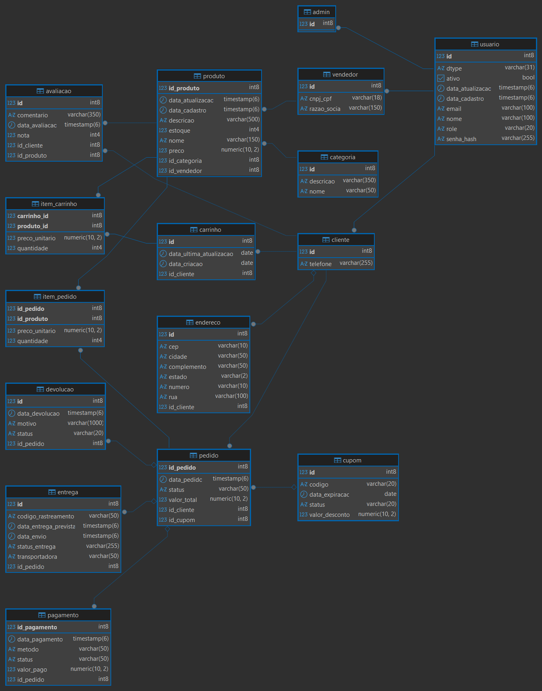

# 🚀 Desenvolvimento e Aplicações Web II - Projeto Marketplace

Este repositório contém o projeto prático da disciplina de **Desenvolvimento e Aplicações Web II** do curso de Análise e Desenvolvimento de Sistemas (ADS) - IFPB. O projeto evoluiu do mapeamento objeto-relacional inicial (JPA) para uma **API REST completa de marketplace (e-commerce)**, com autenticação, regras de negócio e persistência em banco de dados.

---

## 📖 Sobre o Projeto

A aplicação é uma API REST que gerencia as operações de um marketplace, conectando clientes e vendedores. O projeto iniciou com o **Mapeamento Objeto-Relacional (ORM)** de um modelo de dados desenvolvido na disciplina de Banco de Dados I, utilizando JPA/Hibernate, e evoluiu para uma arquitetura em camadas (controller → service → repository), com padrão DAO nas camadas de persistência, autenticação JWT e controle de acesso baseado em perfis.

---

## 🛠️ Tecnologias Utilizadas

* **Linguagem:** Java 17+
* **Framework:** Spring Boot
* **Persistência:** JPA / Hibernate
* **Banco de dados:** PostgreSQL
* **Segurança:** Spring Security com autenticação JWT (jjwt)
* **Documentação:** Swagger / OpenAPI (springdoc)
* **Build Tool:** Maven

---

## 🏗️ Estrutura e Padrões Implementados

### 1. Camada de Modelo (Entities)
Entidades mapeadas com as anotações padrão do JPA (`@Entity`, `@Table`, `@Id`, `@GeneratedValue`, `@Column`), incluindo implementação de `equals()`, `hashCode()` e `toString()`.

### 2. Camada de Persistência (DAO / Repository)
* **Interface base:** `br.edu.ifpb.es.daw.dao.DAO`
* **Implementação abstrata:** `br.edu.ifpb.es.daw.dao.impl.AbstractDAOImpl`
* Repositórios Spring Data por entidade.

### 3. Camada de Serviço (Services)
Regras de negócio centralizadas nos serviços de cada entidade (ex.: `CupomService`, `DevolucaoService`, `ProdutoService`), incluindo validações de negócio como o fluxo de estados das devoluções (PENDENTE → APROVADA/REJEITADA).

### 4. Camada REST (Controllers)
Controllers REST por entidade, com DTOs de requisição e resposta, paginação nas listagens, endpoints de busca com filtragem por parâmetros opcionais (JPQL) e documentação Swagger (`@Operation`, `@Schema`).

### 5. Segurança e Autenticação
* **Login:** `POST /auth/login` retorna um token JWT.
* **Filtro JWT:** `JwtAuthenticationFilter` para autenticação stateless de cada requisição.
* **Controle de acesso:** `@PreAuthorize` em todos os endpoints:
  * **ADMIN:** acesso total ao sistema.
  * **VENDEDOR:** gerencia seus produtos e dados permitidos.
  * **CLIENTE:** realiza pedidos, avaliações e gerencia seu perfil.
* Rotas públicas: `/auth/login`, cadastro de clientes e vendedores (`POST /clientes`, `POST /vendedores`) e Swagger.

### 6. Seed de Dados
* **Admin padrão** criado automaticamente no primeiro boot da aplicação.
* Endpoints `POST /seed/popular` e de limpeza do banco (restritos a ADMIN) para popular e limpar os dados de teste.

---

## 🔐 Credenciais do Admin Padrão

| Campo | Valor |
| :--- | :--- |
| E-mail | `admin@marketplace.com` |
| Senha | `admin123` |

---

## ⚙️ Configuração do Ambiente

O arquivo `src/main/resources/application.properties` **não está versionado** (protegido no `.gitignore` para evitar exposição de credenciais). Ao clonar o projeto, crie esse arquivo com as configurações do seu PostgreSQL local (URL, usuário e senha do banco).

---

## ▶️ Como Executar

1. Configure o `application.properties` com o seu PostgreSQL.
2. Suba a aplicação: `mvn spring-boot:run`.
3. Verifique no console a mensagem de sucesso e a criação do admin padrão.
4. Acesse o Swagger: `http://localhost:8080/swagger-ui/index.html`.
5. Faça login em `POST /auth/login` com as credenciais do admin padrão.
6. Copie o token retornado e clique no botão **Authorize** no topo do Swagger (esquema `bearer-jwt`).
7. Use `POST /seed/popular` para carregar dados de teste.

---

## 🗺️ Modelo de Dados

Abaixo, a representação visual do modelo conceitual do projeto, desenvolvido na disciplina de Banco de Dados I:

---

**Desenvolvido por:** Lucas Barbosa, Paulo Moura e Valdênio Pantaleão,
Estudantes de ADS 4° período - IFPB
